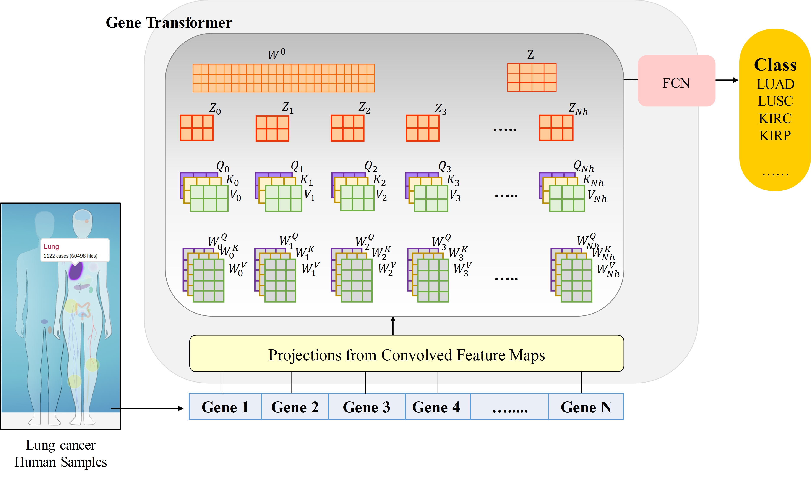
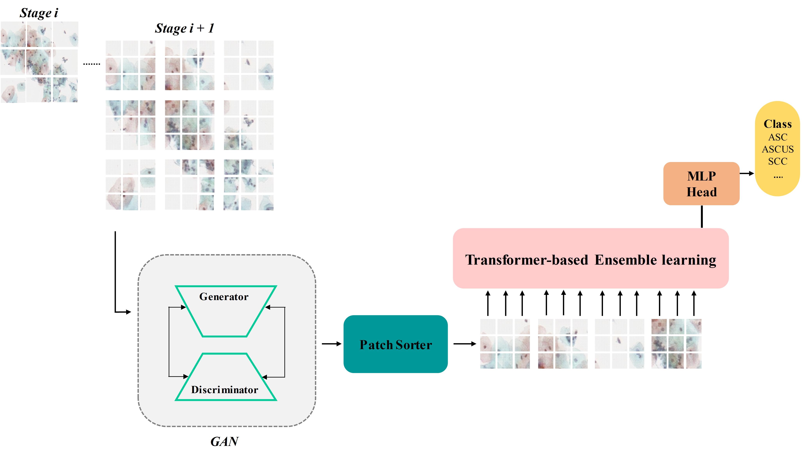

# Anwar Khan
# **Projects**
## Project # 01: Artificial Intelligence-based Drug Discovery
This project is divided into two parts:

## a) Artificial Intelligence-Based Discovery of Cancer-Specific Metabolic Biomarkers.

### Motivation:

Immune check-point inhibitors (CPIs) have shown durable clinical responses across various cancer types. Nevertheless, only a small subset of patients responds durably to CPIs. To maximize patient benefit and minimize toxicity, new biomarkers are needed to identify responders to CPI mono-therapy and to inform combination approaches for non-responders. However, a single biomarker effective across tumor types remains elusive. The inclusion of metabolic signatures may provide significant information beyond routine prognosis in several cancer types. 

### Contribution: 

In this study, using the expression profiles of metabolic-related genes, an encoder-decoder-based deep learning algorithm is developed to extract relevant biomarkers contributing to tumor initiation and progression and overall survival of different cancer types. Expression profiles of melanoma, gastric cancer, and lung cancer were used in this research.

### Results: 

Our team discovered several metabolic biomarkers which are common across melanoma, gastric, and lung cancer. Two of the discovered biomarkers have been validated via wet-lab experiments, and the remaining one is still under investigation. This study will be a breakthrough in identifying responders to CPI mono-therapy and will facilitate the implementation of more personalized and specific disease-modifying therapies in the future.

## b) Gene Transformer: Transformer for the Gene Expression-based Classification of Cancer Subtypes (Peer-reviewed).

### Motivation: 

Cancer and its subtypes constitute approximately 30% of all causes of death globally and display a wide range of heterogeneity in terms of clinical and molecular responses to therapy. Molecular subtyping has enabled the use of precision medicine to overcome these challenges and provide significant biological insights to predict prognosis and improve clinical decision-making. Over the past decade, conventional machine learning (ML) and deep learning (DL) algorithms have been widely espoused for the classification of cancer subtypes from gene expression datasets. However, these methods are potentially biased toward the identification of cancer biomarkers. 

### Contribution: 

Proposed an end-to-end deep learning approach, Gene Transformer, which addresses the complexity of high-dimensional gene expression with a multi-head self-attention module by identifying relevant biomarkers across multiple cancer subtypes without requiring feature selection as a pre-requisite for the current classification algorithms. Our work is among a few studies to suggest that a multi-head self-attention layer with an adequate number of heads can perform convolutions and is less expensive than ordinary 2D convolutional layers.

###  Results: 

Comparative analysis reveals that the proposed Gene Transformer outperformed the commonly used traditional and state-of-the-art classification algorithms on TCGA dataset and can be considered as an efficient approach for classifying cancer and its subtypes, indicating that any improvement in deep learning models in computational biologists can be reflected well in this domain as well.

Graphical illustration is as follows: 

## Project # 02: Artificial Intelligence in Cancer Pathology

This project is divided into two parts:

## a) Understanding Cervical Cancer Pathology via Multiscale Transformer-Based Learning Framework.
(Manucript under-writing)

### Motivation: 

Cervical cancer affects around 0.5 million women per year, resulting in over 0.3 million fatalities. Therefore, repetitive screening for cervical cancer is of utmost importance. Computer-assisted diagnosis is key for scaling up cervical cancer screening. Current recognition algorithms, however, perform poorly on whole-slide image (WSI) analysis, fail to generalize for different staining methods and on uneven distribution for subtype imaging, and also provide sub-optimal clinical-level interpretations. 

###  Contribution: 

Herein, I developed an end-to-end multiscale transformer-based learning framework to assess pre-cancerous and cancer-specific cervical malignant lesions on WSIs. The proposed framework consists of (1) a generative adversarial network for generating synthetic images to address the class imbalanced problem, (2) a multiscale transformer-based learning method for cell identification at various stages, including atypical Squamous Cells (ASC-H) and atypical squamous cells of undetermined significance (ASCUS), which have not been demonstrated in previous studies, and (3) a fusion model for concatenating multiscale features and producing final outcomes. 

### Results: 

In evaluation, the proposed method is first evaluated on a private dataset of 717 annotated samples from six classes using cross-validation, obtaining high recall and precision of 0.940 and 0.934, respectively, in roughly 1.2 minutes. For clinical interpretation, we used GradCAM to visualize a coarse localization map, highlighting important regions in the WSI. Notably, the proposed framework extracted features are mostly from the cell nucleus and partially from the cytoplasm. In comparison with the existing state-of-the-art benchmark methods, the proposed framework outperforms them in terms of recall, accuracy, and computing time.

### Future work:   

On-premise deployment of the proposed pre-trained model will be looked into t oensure low latency and high throughput furthermore. 

## b) Deciphering Adversarially Generated Cervical Pap Smear Cells using Transformers-Based Ensemble Learning.
(Accepted at IUPESM World Congress on Medical Physics and Biomedical Engineering 2022 (IUPESM WC2022)).

 
Graphical illustration is as follows: 

## c) Artificial Intelligence to Decipher Prognostic Molecular Biomarkers in Cancer Pathology.
(Research in progress)

### Motivation:

Prognostic biomarkers allow the alienation of patients according to their risk of disease progression or death and, accordingly, to adjust treatment intensity for individual patients in precision medicine. 

### Contribution:

Proposed an transformer-based deep learning model that facilitates the extraction of recurring patterns that constitute a new class of biomarkers with potential prognostic and/or predictive information.  
  

