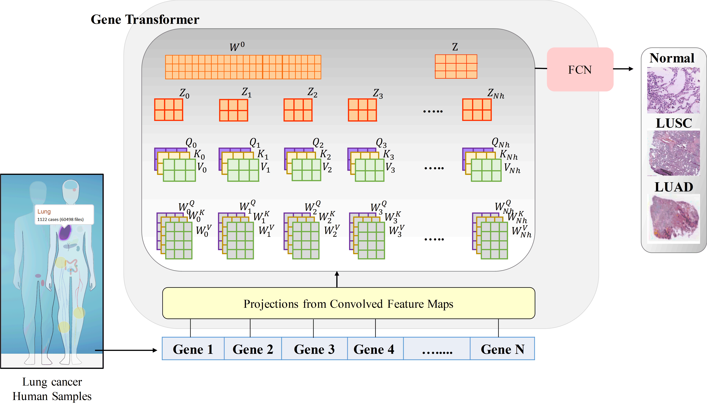

# Anwar Khan
# **Projects**
## 1.  AI-Based Discovery of Cancer-Specific Metabolic Biomarkers.
This project falls under the umbrella of the main project named “*Artificial Intelligence-based Drug Discovery*.”, alienated into two parts:
* Proposing a deep learning-based feature selection method to extract relevant metabolic biomarkers from cancer-specific expression profiles.
* In Vitro validation of the extracted biomarkers. \
\
## Motivation: 

Numerous research have revealed that metabolic rewiring in the cancer cells is one of the determining factors during tumor initiation and progression. Thus, the inclusion of metabolic signatures may provide significant information beyond routine prognosis in several cancer types. In this study, utilizing the cancer expression profiles of metabolic genes, a deep learning-based algorithm is developed to extract relevant biomarkers contributing to tumor initiation and progression and overall survival of different cancer types. Expression profiles of melanoma, gastric cancer, and lung cancer were used in this study. Results of the proposed algorithm were compared with conventional feature selection methods such as recursive feature selection (RFE), mutual information (MI), sequential forward floating selection (SFFS), and sequential backward floating selection (SBFS). 

Now, the results of the algorithm implementations (proposed and commonly used feature selected methods) are submitted to one of the project collaborators for the in vitro validation of the extracted biomarkers as well as to establish the significance of the research.

## 2.  Gene Transformer: Transformer for the Gene Expression Based Classification of Lung Cancer Subtypes.

## Motivation: 

Adenocarcinoma and squamous cell carcinoma constitute approximately 40% and 30% of all lung cancer subtypes, respectively, and display broad heterogeneity in terms of clinical and molecular responses to therapy. Molecular subtyping has enabled the use of precision medicine to overcome these challenges and provide significant biological insights to predict prognosis and improve clinical decision-making. Over the past decade, conventional ML algorithms and DL-based CNNs have been widely espoused for the classification of cancer subtypes from gene expression datasets. However, these methods are potentially biased toward the identification of cancer biomarkers. 

Hence, we proposed an end-to-end deep learning approach, Gene Transformer, which addresses the complexity of high-dimensional gene expression with a multi-head self-attention module by identifying relevant biomarkers across multiple cancer subtypes without requiring feature selection as a prerequisite for the current classification algorithms. Comparative analysis reveals that the proposed Gene Transformer outperformed the commonly used traditional classification algorithms and can be considered as an efficient approach for classifying cancer subtypes, indicating that any improvement in deep learning models in computational biologists can be reflected well in this domain as well.

Graphical illustration of Gene Transformer architecture is as follows: 
\
\

